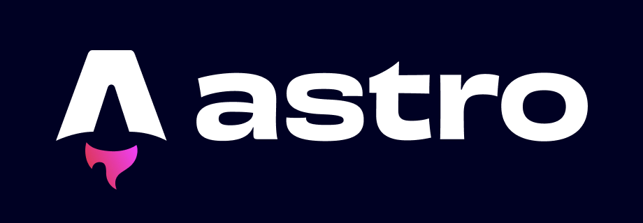

Para colocar este blog em produção, eu precisava de, pelo menos, um artigo publicado. Então, nada melhor do que documentar a própria experiência de construir essa estrutura e compartilhar como tirei o Alishot Labs do papel.

A ideia era ter algo simples e que não me custasse muito (o ideal era que fosse 0800 😂), então comecei a pesquisar um pouco **sobre** as tecnologias que estavam em alta. Eu sempre gostei de **React** e tive experiências bem positivas com o **Next.js**, então queria algo na mesma pegada: que gerasse páginas estáticas e resultasse naquele site rápido.

Pesquisando um pouco, decidi o seguinte:

## A Stack

* **Framework:** Astro (pela performance de site estático e porque está bem em alta no mercado).
* **Template:** Astro Paper (um sistema de blog pronto, minimalista e focado em conteúdo).
* **Domínio:** Eu já tinha um domínio .dev, então aqui só criei um subdomínio. (Você deve gastar perto de uns 15 dólares por ano; recomendo comprar pela Cloudflare, gostei muito da plataforma deles).
* **Hospedagem:** Vercel (deploy fácil, integrado com o **GitHub** e grátis — pelo menos na época).
* **CMS:** Keystatic (para não precisar escrever **Markdown** na mão e conseguir criar e atualizar as coisas pelo próprio celular).

Não quero reinventar a roda, e também não quero que este artigo fique obsoleto rápido, então não vou escrever um passo a passo de como rodar o Astro. Porém, posso dizer que foi tudo muito rápido: só tive que clonar o repo, instalar as dependências e pronto — ele já vem com alguns artigos de exemplo e tudo funciona perfeitamente de primeira.

O que fiz depois disso foi apenas ajustar os estilos (light/dark) com as cores que preferi e configurar o idioma para português, traduzindo tudo o que ficasse visível para o usuário.

## Por que Astro Paper?

O Astro é incrível porque entrega zero JavaScript por padrão. O template **Astro Paper** já vem com boas práticas de SEO, modo escuro/claro e uma estrutura limpa de arquivos.

## O desafio do CMS: Keystatic

Eu não queria depender de um banco de dados externo ou de um CMS pesado como WordPress. O [Keystatic](https://keystatic.com/) foi a escolha perfeita porque ele é um "CMS baseado em Git".

Basicamente, ele roda localmente (ou no navegador), me dá uma interface visual bonita para escrever, mas no final ele apenas cria arquivos Markdown no meu repositório.

### O Pulo do Gato: Markdown vs MDX

Aqui foi onde quebrei a cabeça. O Astro Paper vem configurado nativamente para ler arquivos `.md` (Markdown simples). Porém, o Keystatic trabalha melhor com `.mdx` (Markdown + JSX), que permite componentes mais ricos.

Tive que fazer algumas adaptações:

1. Instalar a integração `@astrojs/mdx`.
2. Renomear os arquivos antigos de conteúdo.
3. Ajustar o `keystatic.config.ts` para entender que o título do post é a chave de tudo.

## Conclusão

Agora o fluxo é simples: abro o painel do Keystatic, escrevo o post, salvo e dou um `git push`. A Vercel detecta a mudança e em menos de um minuto o site está atualizado.

Este é apenas o começo. Pretendo usar este espaço para compartilhar aprendizados sobre código, esportes e vida.

Se você curtiu essa stack, dá uma olhada no repositório do Astro Paper e tente subir o seu!
