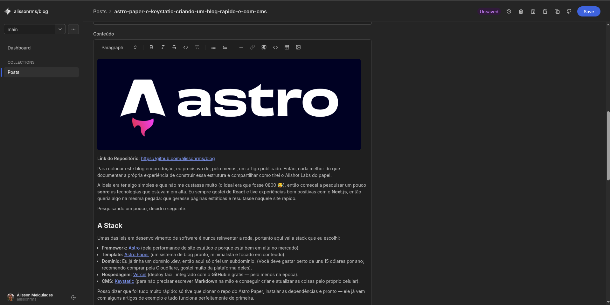

**Link do Repositório**: [https://github.com/alissonrms/blog](https://github.com/alissonrms/blog)

Para colocar este blog em produção, eu precisava de, pelo menos, um artigo publicado. Então, nada melhor do que documentar a própria experiência de construir essa estrutura e compartilhar como tirei o Alishot Labs do papel.

A ideia era ter algo simples e que não me custasse muito (o ideal era que fosse 0800 😂), então comecei a pesquisar um pouco **sobre** as tecnologias que estavam em alta. Eu sempre gostei de **React** e tive experiências bem positivas com o **Next.js**, então queria algo na mesma pegada: que gerasse páginas estáticas e resultasse naquele site rápido.

Pesquisando um pouco, decidi o seguinte:

## A Stack

Umas das leis em desenvolvimento de software é nunca reinventar a roda, portanto aqui vai a stack que eu escolhi:

* **Framework:** [Astro](https://astro.build/) (pela performance de site estático e porque está bem em alta no mercado).
* **Template:** [Astro Paper](https://astro.build/themes/details/astropaper/) (um sistema de blog pronto, minimalista e focado em conteúdo).
* **Domínio:** Eu já tinha um domínio .dev, então aqui só criei um subdomínio. (Você deve gastar perto de uns 15 dólares por ano; recomendo comprar pela Cloudflare, gostei muito da plataforma deles).
* **Hospedagem:** [Vercel](https://vercel.com/) (deploy fácil, integrado com o **GitHub** e grátis — pelo menos na época).
* **CMS:** [Keystatic](https://keystatic.com/) (para não precisar escrever **Markdown** na mão e conseguir criar e atualizar as coisas pelo próprio celular).

Posso dizer que foi tudo muito rápido: só tive que clonar o repo do Astro Paper, instalar as dependências e pronto — ele já vem com alguns artigos de exemplo e tudo funciona perfeitamente de primeira.

O que fiz depois disso foi apenas ajustar os estilos (light/dark) com as cores que preferi e configurar o idioma para português, traduzindo tudo o que ficasse visível para o usuário.

Eu não quero que esse artigo fique obsoleto muito rapidamente, portanto não vou colocar um passo a passo aqui de tudo o que eu fiz, se tu tiver interessado recomendo clonar meu repo, alterar as configs e rodar localmente, prometo que é muito simples.

**Link do Repositório**: [https://github.com/alissonrms/blog](https://github.com/alissonrms/blog)


Aqui vai algumas fotos de como fica o Keystatic e a criação de um novo post:




## Por que Astro Paper?

O Astro é incrível porque entrega zero JavaScript por padrão. O template **Astro Paper** já vem com boas práticas de SEO, modo escuro/claro e uma estrutura limpa de arquivos.

## O desafio do CMS: Keystatic

Eu não queria depender de um banco de dados externo ou de um CMS pesado como WordPress. O [Keystatic](https://keystatic.com/) foi a escolha perfeita porque ele é um "CMS baseado em Git".

Basicamente, ele roda localmente (ou no navegador), me dá uma interface visual bonita para escrever, mas no final ele apenas cria arquivos Markdown no meu repositório.

### O Pulo do Gato: Markdown vs MDX

Aqui foi onde quebrei a cabeça. O Astro Paper vem configurado nativamente para ler arquivos `.md` (Markdown simples). Porém, o Keystatic trabalha melhor com `.mdx` (Markdown + JSX), que permite componentes mais ricos.

Tive que fazer algumas adaptações:

1. Instalar a integração `@astrojs/mdx`.
2. Renomear os arquivos antigos de conteúdo.
3. Ajustar o `keystatic.config.ts` para entender que o título do post é a chave de tudo.

```keystatic.config.ts
import { config, fields, collection } from '@keystatic/core';

export default config({
  storage: import.meta.env.PROD
    ? {
        kind: 'github',
        repo: 'alissonrms/blog',
      }
    : {
        kind: 'local',
      },
  
  collections: {
    posts: collection({
      label: 'Posts',
      slugField: 'title',
      path: 'src/data/blog/*',
      format: { contentField: 'content' },

      schema: {
        title: fields.slug({ 
          name: {
            label: 'Título',
            validation: { isRequired: true }
          },
          slug: {
            label: 'Nome do Arquivo (Slug)',
            description: 'Isso define o nome do arquivo físico .mdx'
          }
        }),

        slug: fields.text({
          label: 'URL Personalizada (postSlug)',
          description: 'Opcional. Se vazio, o Astro usa o nome do arquivo.',
        }),

        pubDatetime: fields.datetime({
          label: 'Data de Publicação',
          validation: { isRequired: true }
        }),

        description: fields.text({
          label: 'Descrição Curta',
          multiline: true,
          validation: { length: { min: 10 } }
        }),

        author: fields.text({
            label: 'Autor',
            defaultValue: 'Alishot', 
        }),

        draft: fields.checkbox({
            label: 'Rascunho (Draft)',
            defaultValue: false
        }),
        
        featured: fields.checkbox({
            label: 'Destaque (Featured)',
            defaultValue: false
        }),

        tags: fields.array(
            fields.text({ label: 'Tag' }),
            {
                label: 'Tags',
                itemLabel: props => props.value,
            }
        ),

        ogImage: fields.text({
            label: 'Caminho da Imagem (OG Image)',
            description: 'Ex: /assets/images/minha-foto.png',
        }),

        content: fields.mdx({
            label: 'Conteúdo',
            options: {
                image: {
                    directory: 'src/assets/images',
                    publicPath: '../../assets/images/',
                }
            }
        }),
        
        modDatetime: fields.datetime({ label: 'Data de Modificação' }),
        canonicalURL: fields.url({ label: 'URL Canônica' }),
        hideEditPost: fields.checkbox({ label: 'Esconder botão de editar' }),
        timezone: fields.text({ label: 'Timezone' }),
      },
    }),
  },
});
```

## Conclusão

Agora o fluxo é simples: abro o painel do Keystatic (/keystatic) pelo próprio site, logo com meu github, escrevo o post ou edito o que quero editar, salvo e pronto, automaticamente o keystatic já dá um  `git push`, a Vercel detecta a mudança e em menos de um minuto o site está atualizado.

Se eu quiser testar alguma coisa antes de ir para o site em produção, posso somente mudar para alguma branch separada no próprio painel do keystatic e abrir um `pull request`, desse modo a Vercel já cria um link para teste com meus updates e eu só preciso dar merge se tudo estiver ok.

Este é apenas o começo. Pretendo usar este espaço para compartilhar aprendizados sobre código, esportes e vida.

Se você curtiu essa stack, dá uma olhada no repositório do Astro Paper e tente subir o seu!
